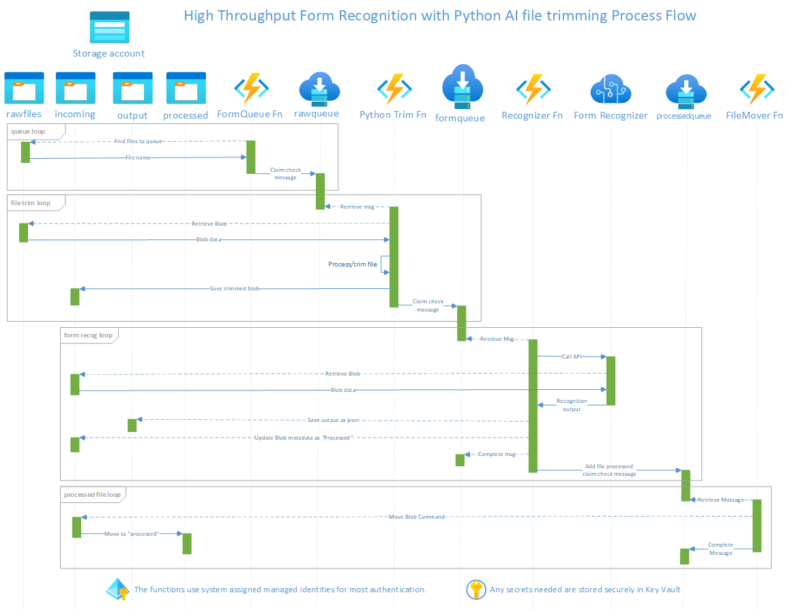

# High Throughput Form Recognizer

This repository is offered to demonstrate a set of resources that will allow you to leverage [Azure Form Recognizer](https://docs.microsoft.com/en-us/azure/applied-ai-services/form-recognizer/) for high throughput of processing documents stored in Azure Blob Storage.

## Features

This solution leverages the following Azure services:

- **Azure Blob Storage** with three containers
  - `incoming`  - stores the forms/files that you want to process
  - `output` - the location where the Form Recognition JSON output is stored. The file names match the original files, with the extension changed to `.json`
  - `processed` - where the forms/files are moved to once successfully processed by Form Recognizer
- **Azure Service Bus** with two queues
  - `formqueue` - this contains the messages for the files that need to be processed
  - `processedqueue` - this contains the messages for files that have been processed and need to be moved to the `processed` blob container
- **Form Recognizer** - the Azure Cognitive Services API that will perform the form recognition and processing.
- Three **Azure Functions**
  - `FormQueue` - identifies the files in the `incoming` blob container and send a claim check message (containing the file name) to the `formqueue` queue
  - `Recognition` - processes the message in `formqueue` to Form Recognizer, then update Blob metadata as "processed" and create new message in `processedqueue` queue \
    This function employs scale limiting and [Polly](https://github.com/App-vNext/Polly) retries with back off for Form Recognizer 429 (too many requests) replies to balance maximum throughput and overloading the API endpoint
  - `FileMover` - processes messages in the `processedqueue` to move files from `incomming` to `processed` blob containers

### Multiple Form Recognizer endpoints

To further allow for high throughput, the `Recognition` function can distribute form recognition between 1-10 separate Form Recognizer accounts. This is managed by the `FormQueue` funtion automatically adding a `RegognizerIndex` value of 0-9 when queueing the files for processing. 

The recognizer will distribute the files to the appropriate account (regardless of the number of Form Recognizer accounts actually provisioned). 

To configure multiple Form Recognizer accounts with the script below, add a value between 1-10 for the `-formRecognizerInstanceCount` (default is 1). To configure manually, you will need to add all of the Form Recognizer account keys to the Azure Key Vault's `FORM-RECOGNIZER-KEY` secret -- _space separated_

_Assumption:_ all instances of the Form Recognizer share the same URL (such as: https://eastus.api.cognitive.microsoft.com/)

## Process Flow



## Get Started

To try out the sample end-to-end process, you will need:

- An Azure subscription that you have privileges to create resources. 
- Your public IP address. You can easily find it by following [this link](https://www.bing.com/search?q=what+is+my+ip).
- Have the [Azure CLI installed](https://docs.microsoft.com/en-us/cli/azure/install-azure-cli).

### Running deployment script

1. Login to the Azure CLI:  `az login`
2. Run the deployment command

    ``` PowerShell
    .\deploy.ps1 -appName <less than 6 characters> -location <azure region> -myPublicIp <your public ip address>

    ```

This will create all of the azure resources needed for the demonstration.

### Running a demonstration

To exercise the code and run the demo, follow these steps:

1. Upload sample form file to the storage account's `incoming` container. To help with this, you can try the supplied PowerShell script [`BulkUploadAndDuplicate.ps1`](Scripts/BulkUploadAndDuplicate.ps1). This script will take a directory of local files and upload them to the storage container. Then, based on your settings, duplicate them to help you easily create a large library of files to process

    ```Powershell
    .\BulkUploadAndDuplicate.ps1 -path "<path to dir with sample file>" -storageAccountName "<storage account name>" --containerName "incoming" -counterStart 0 -duplicateCount 10
    ```

    The sample script above would would upload all of the files found in the `-path` directory, then create copies of them prefixed with 000000 through 000010. You can of course upload the files any way you see fit.

2. In the Azure portal, navigate to the resource group that was created and locate the function with "Queue" in the name. Then select the Functions list and select the function method `FormQueue`. In the "Code + Test" link, select Test/Run and hit "Run". This will kick off the queueing process for all of the files in the `incoming` storage container. The output will be the number of files that were queued.

3. Once messages start getting queued, the `Processor` function will start picking up the messages and begin processing. You should see the number of messages in the `FormQueue` queue go down as they are successfully processed. You will also see new files getting created in the `output` container.

4. Simultaneously, as the `Processor` function completes it's processing and queues messages in the `processedqueue` queue, the `Mover` function will begin picking up those messages and moving the processed files from the `incomming` container into the `processed` container.

5. You can review the execution and timings of the end to end process
